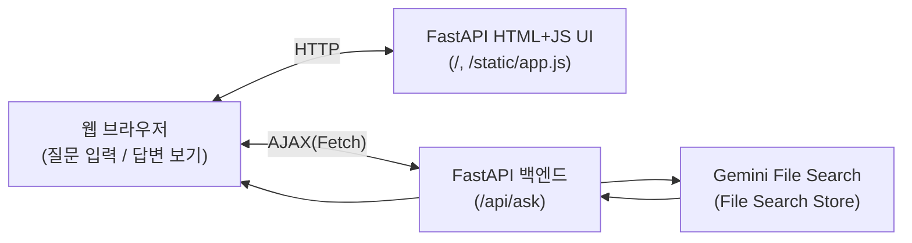

# **Gemini File Search 

## **FastAPI 기반 “Milky RAG 웹 UI”**  😺

---

## 1. 전체 구조 그림 (아키텍처)



- 브라우저: 텍스트 입력 → `/api/ask` 호출 → JSON 응답 → 화면에 표시
- FastAPI: 질문 받아서 → Gemini(File Search Store) RAG 호출 → 응답 반환
- Milky: system prompt로 역할 부여

---

## 2. 프로젝트 구조 제안

```
filesearch_milky/
├─ app/
│  ├─ main.py           # FastAPI 진입점
│  ├─ config.py         # 환경변수 등 설정
│  ├─ gemini_rag.py     # Gemini File Search RAG 호출 로직
│  └─ __init__.py
├─ templates/
│  └─ index.html        # 메인 웹 페이지 (Jinja2 템플릿)
├─ static/
│  └─ app.js            # 프론트엔드 JS (fetch로 질문 전송)
├─ .env.example         # 환경변수 예시
├─ requirements.txt
└─ README.md (선택)

```

---

## 3. `requirements.txt`

```
fastapi
uvicorn[standard]
jinja2
python-multipart
google-genai
python-dotenv

```

```bash
python3 -m venv .venv
source .venv/bin/activate 

pip install -r requirements.txt

```

---

## 4. `.env.example`

```
# Google Gemini API 키
GOOGLE_API_KEY=your_google_api_key_here

# 이미 만들어둔 File Search Store 이름
# 예시: fileSearchStores/my-file_search-store-1234567890
FILE_SEARCH_STORE_NAME=fileSearchStores/my-file_search-store-7235

# 사용할 Gemini 모델
GEMINI_MODEL=gemini-2.5-flash

```

실제로는 `.env`로 복사해서 값만 채우면 됩니다.

```bash
cp .env.example .env

```

---

## 5. `app/config.py` – 설정 관리

```python
import os
from dotenv import load_dotenv

load_dotenv()

GOOGLE_API_KEY = os.getenv("GOOGLE_API_KEY")
FILE_SEARCH_STORE_NAME = os.getenv("FILE_SEARCH_STORE_NAME")
GEMINI_MODEL = os.getenv("GEMINI_MODEL", "gemini-2.5-flash")

if not GOOGLE_API_KEY:
    raise RuntimeError("환경변수 GOOGLE_API_KEY 가 설정되어 있지 않습니다.")

if not FILE_SEARCH_STORE_NAME:
    raise RuntimeError("환경변수 FILE_SEARCH_STORE_NAME 가 설정되어 있지 않습니다.")

```


## 6. `app/gemini_rag.py` – Milky RAG 핵심 로직

## 7. `app/main.py` – FastAPI 앱 & 라우팅

## 8. `templates/index.html` – 간단 Milky 웹 UI
## 9. `static/app.js` – 질문 전송 & 응답 표시

## 10. 실행 방법

프로젝트 루트(`milky_rag_web/`)에서:

```bash
# uvicorn app.main:app --reload

uvicorn app.main:app --host 0.0.0.0 --port 8060 --reload

# 방화벽
sudo ufw status

sudo ufw allow 8060/tcp
sudo ufw reload

```

브라우저에서:

```
<http://127.0.0.1:8000/>
<http://talkative-milky.duckdns.org:8060/>

```

